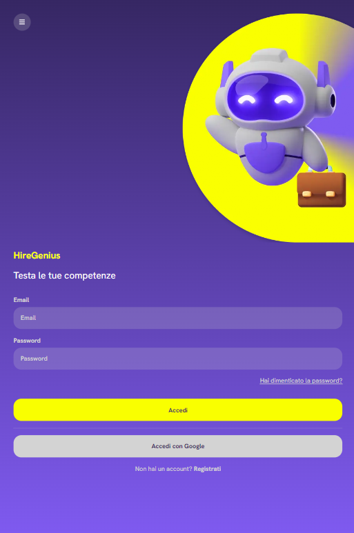
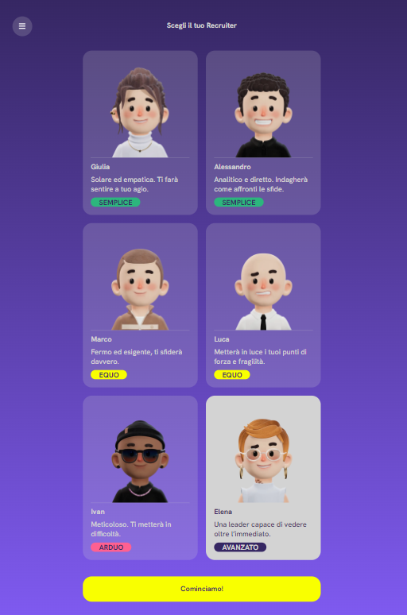
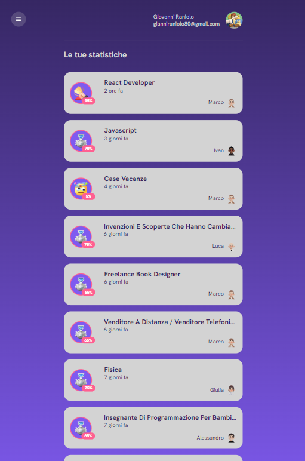

# HireGenius

Nato come parte del Final Project per il **Full-Time Coding Bootcamp di Edgemony** (CB10/2024), _HireGenius_ ha come obiettivo quello di automatizzare e migliorare il processo di apprendimento e test delle competenze, fornendo un'interfaccia semplice e intuitiva per simulare interviste tecniche, colloqui, selezioni e interrogazioni.

<p align="center">
    
    
    
</p>

## Table of Contents

1. [Panoramica](#panoramica)
   - [Caratteristiche Principali](#caratteristiche-principali)
   - [Obiettivi](#obiettivi)
2. [Demo](#demo)
   - [Utilizzo](#utilizzo)
3. [Dietro le Quinte](#dietro-le-quinte)
   - [Stack Tecnologico](#stack-tecnologico)
   - [Struttura del Progetto](#struttura-del-progetto)
   - [Prompt Engineering e JSON](#prompt-engineering-e-json)
   - [Logica di Frontend](#logica-di-frontend)
4. [Contribuisci](#contribuisci)
   - [Prerequisiti](#prerequisiti)
   - [Come Contribuire](#come-contribuire)
5. [Future Implementazioni](#future-implementazioni)
6. [Licenza](#licenza)
7. [Team di Sviluppo E Contatti](#team-di-sviluppo-e-contatti)

## 1. Panoramica 🌐

_HireGenius_ è un'app web innovativa concepita per supportare chiunque desideri migliorare e testare le proprie competenze, trasformando l’esperienza di preparazione per colloqui, interrogazioni scolastiche e universitarie.

Utilizzando l'intelligenza artificiale, offre un ambiente coinvolgente in cui gli utenti possono affrontare domande realistiche e ricevere feedback costruttivi. Questa piattaforma consente a ciascun utente di gestire attivamente il proprio processo di preparazione, migliorando le proprie abilità e aumentando la fiducia.

Grazie a un approccio personalizzato e interattivo, _HireGenius_ garantisce una preparazione mirata ed efficace, aiutando chiunque desideri eccellere nel proprio percorso professionale e accademico.

### Caratteristiche Principali ✨

**Generazione Intelligente di Domande**: Utilizzando sofisticati algoritmi di intelligenza artificiale, _HireGenius_ genera domande tecniche personalizzate in base al ruolo e al livello di esperienza dell'utente. Questo approccio consente una preparazione focalizzata su argomenti rilevanti e situazioni pratiche, aiutando a costruire una solida base di conoscenze.

**Simulazione di Colloqui Reali**: La piattaforma crea un ambiente interattivo di colloquio in cui gli utenti possono rispondere a domande in tempo reale. Questa simulazione realistica aiuta a ridurre l'ansia da prestazione, migliorando le abilità comunicative e la fiducia degli utenti, rendendoli più pronti ad affrontare le interviste nel mondo reale.

**Feedback Dettagliato e Valutazione**: Dopo ogni risposta, gli utenti ricevono un’analisi approfondita che valuta la correttezza, la pertinenza e l’eloquenza delle loro risposte. Questo feedback immediato è cruciale per l’apprendimento e la crescita personale, consentendo agli utenti di apportare miglioramenti istantanei e di affinare le proprie capacità.

**Variabilità degli Intervistatori**: Gli utenti hanno la possibilità di scegliere tra diversi profili di intervistatori, ognuno con stili e approcci distintivi. Questa diversità consente di prepararsi a una varietà di situazioni e personalità diverse, migliorando le abilità di adattamento e la versatilità nell'affrontare colloqui di lavoro.

**Personalizzazione dell'Esperienza**: Ogni utente può configurare il colloquio secondo le proprie preferenze, specificando l'argomento, il livello di difficoltà e il numero di domande. Questa flessibilità rende l’esperienza perfettamente adattabile alle esigenze e agli obiettivi individuali, permettendo a ciascuno di concentrarsi su ciò che è più rilevante per il proprio percorso professionale.

**In sintesi**: _HireGenius_ rappresenta un passo avanti significativo nella preparazione ai colloqui, combinando tecnologia all'avanguardia e un approccio personalizzato per garantire che gli utenti siano pronti e sicuri al momento di affrontare le sfide professionali.

### Obiettivi 🎯

Adottare _HireGenius_ offre numerosi vantaggi che migliorano significativamente l’esperienza di preparazione per i colloqui:

**Preparazione Efficace**: L'approccio mirato dell'app consente agli utenti di esercitarsi su domande specifiche, ricevendo feedback immediato che aiuta a migliorare rapidamente le proprie competenze.

**Incremento della Sicurezza**: Grazie alla simulazione realistica dei colloqui, gli utenti possono affrontare le interviste con maggiore fiducia e meno ansia, preparandosi in un ambiente controllato.

**Accrescimento delle Competenze**: Ogni sessione di colloquio rappresenta un'opportunità per affinare sia le abilità comunicative che quelle tecniche, consentendo risposte sempre più articulate e pertinenti.

**Flessibilità nell'Apprendimento**: La piattaforma è accessibile ovunque e in qualsiasi momento, rendendo l'apprendimento pratico e flessibile.

**Personalizzazione dell’Esperienza**: Gli utenti possono personalizzare le proprie sessioni, concentrandosi sulle aree più rilevanti per il loro percorso professionale, rendendo ogni esperienza unica e su misura per le proprie esigenze.

> Utilizzare _HireGenius_ significa dotarsi di uno strumento potente e
> versatile, in grado di trasformare la preparazione ai colloqui in un
> processo efficace, sicuro e altamente personalizzato.

## Demo 📽️

Per offrirti un'anteprima delle funzionalità di _HireGenius_, abbiamo preparato una demo interattiva. Visita il link qui sotto per esplorare l'applicazione e scoprire come può rivoluzionare la tua preparazione ai colloqui:

<div>

</div>

### [**Inizia il tuo primo colloquio**](https://hire-genius.vercel.app)

> > > > > > ClicK Now

<a href="https://link-alla-demo.com" target="_blank">
 
   <a href="https://hire-genius.vercel.app" target="_blank" style="display: inline-block; padding: 15px 25px; font-size: 18px; font-weight: bold; color: white; background-color: #FF1493; border: solid 2px #FFD700; text-align: center; border-radius: 8px; text-decoration: none;">
  Prova HireGenius

</a>
  </div>
</a>

### Utilizzo 🛠️

Per iniziare a utilizzare _HireGenius_ e prepararti al meglio per i tuoi colloqui, segui questi semplici passaggi:

1. **Crea un Account**: Registrati per un account gratuito per accedere a tutte le funzionalità di _HireGenius_ e iniziare il tuo percorso di preparazione.

2. **Scegli l'Argomento del Colloquio**: Seleziona il tema tecnico su cui desideri concentrarti. Questo ti permetterà di ricevere domande pertinenti e mirate.

3. **Inserisci i Requisiti della Posizione**: Se hai selezionato "Nuovo Colloquio", inserisci i requisiti specifici della posizione lavorativa per ricevere domande più rilevanti e contestualizzate.

4. **Imposta il Livello di Difficoltà**: Scegli il livello di difficoltà che meglio si adatta ai colloqui che intendi affrontare, assicurando così una preparazione adeguata.

5. **Seleziona l'Intervistatore**: Scegli un profilo di intervistatore con uno stile di domande che desideri praticare, per familiarizzare con diverse modalità di colloquio.

6. **Inizia il Colloquio**: Rispondi alle domande generate dall'intelligenza artificiale e ricevi feedback e valutazioni in tempo reale per migliorare le tue prestazioni.

7. **Rivedi i Risultati**: Dopo il colloquio, analizza le tue prestazioni, identifica le aree di miglioramento e adatta la tua preparazione in base ai suggerimenti ricevuti.

8. **Profilo**: Le interviste e i colloqui che hai sostenuti saranno sempre disponibili per future consultazioni nella sezione "Profilo".

<p align="center">
    
</p>

## Dietro le Quinte 🎭

La combinazione di prompt engineering, JSON strutturati e un approccio modulare ci ha consentito di ottimizzare l'interazione con i modelli di IA, garantendo risposte pertinenti e di alta qualità. La logica del frontend gestisce l'interazione utente in modo fluido, permettendo di ottenere un'esperienza utente efficace e intuitiva. Implementare questa architettura ha richiesto attenzione ai dettagli, sia nella progettazione che nella gestione. Di seguito alcune informazioni che riguardano l'aspetto tecnico.

### Stack Tecnologico 🛠️

#### Frontend

- **Next.js**: Ambiente di sviluppo utilizzato per gestire il routing e le pagine tramite il pages router, ottimizzando le performance dell'applicazione.

- **React.js**: La libreria principale impiegata per la creazione di componenti dell’interfaccia utente, utilizzando un approccio atomico (Atomi, Molecole, Organismi) per garantire una costruzione modulare e riutilizzabile.

- **Sass**: Utilizzato per la gestione degli stili avanzati, facilitando la scrittura di CSS più pulito e mantenibile.

- **TypeScript**: Implementato per fornire tipizzazione statica, migliorando la sicurezza e la leggibilità del codice.

#### Backend & AI

- **Gemini-Pro 1.5 Flash**: Piattaforma AI che genera domande e risposte basate su prompt strutturati, fornendo risultati in formato JSON per la visualizzazione nel frontend.

- **Firebase Authentication**: Utilizzato per gestire l'autenticazione degli utenti, garantendo un accesso sicuro e semplice alla piattaforma.

- **Firebase Firestore**: Adottato come database per memorizzare e gestire i dati degli utenti e le informazioni delle sessioni di colloquio in tempo reale.

- **Google Analytics**: Integrato per monitorare le metriche di utilizzo e ottenere insights sul comportamento degli utenti, facilitando l'ottimizzazione della piattaforma.

- **Next.js**: Utilizzato anche in backend per creare gli endpoint API che gestiscono le chiamate alla piattaforma AI, facilitando l'interazione tra il frontend e il backend stesso.

#### Hosting

**Vercel**: Scelto per l'hosting del progetto, offre distribuzione rapida e sicura, ottimizzando le performance dell'applicazione Next.js.

#### Dipendenze

Di seguito le principali dipendenze utilizzate nel progetto:

- **@google/generative-ai**: Libreria per l'integrazione con i modelli AI di Google, utilizzata per la generazione di domande e risposte.
- **date-fns**: Utilizzata per gestire e formattare le date nel progetto.
- **firebase**: Libreria per l'integrazione con Firebase, utilizzata per autenticazione e gestione del database.
- **next**: Il framework utilizzato per il routing e la generazione delle pagine.
- **react**: Libreria per la creazione dell'interfaccia utente basata su componenti.
- **react-dom**: Permette il rendering dei componenti React nel DOM.
- **sass**: Utilizzato per la gestione degli stili CSS tramite una sintassi più avanzata.
- **uuid**: Utilizzato per generare identificatori unici.

### Struttura del Progetto 📁

Il progetto è organizzato come segue:

```bash
hire-genius/
├── public/               # Risorse statiche come immagini e icone
├── package.json          # File per la gestione delle dipendenze del progetto
└── src/                  # Contiene il codice sorgente principale dell'app
    ├── api/              # Contiene la configurazione API e gli endpoints all'AI
    ├── components/       # Componenti riutilizzabili dell’interfaccia utente
    │   ├── atoms/        # Componenti atomici, elementi di base
    │   │   ├── Button.tsx     # Componente per i pulsanti
    │   │   ├── Label.tsx      # Componente per le etichette
    │   │   └── ...            # Altri componenti atomici
    │   ├── molecules/     # Combinazioni di componenti atomici
    │   │   ├── InputBox.tsx    # Componente per la gestione degli input
    │   │   ├── TextAreaBox.tsx # Componente che gestisce l’input testuale esteso
    │   │   └── ...            # Altri componenti molecolari
    │   ├── organisms/     # Componenti complessi formati da molecole
    │   │   ├── QuestionCard.tsx # Componente che visualizza ogni domanda
    │   │   └── ...            # Altri componenti organismi
    ├── constants/        # Contiene i profili degli esaminatori e i testi dell'applicazione (label e quant'altro)
    ├── lib/              # Contiene il file di configurazione per Firebase
    ├── pages/            # Pagine principali dell’app
    │   ├── index.tsx     # Pagina iniziale dell’app
    │   ├── topic-process  # Pagina per cominciare un test su un Topic
    │   ├── interview-process # Pagina per cominciare un test su un Colloquio
    │   └── ...
    ├── context/          # Contesto per l'autenticazione utente
    │   └── AuthContext.tsx # File per la gestione dell'autenticazione
    ├── middleware/witAuth.tsx       # Higher-Order Component (HOC) per proteggere le rotte
    │   └── withAuth.tsx  # HOC per la protezione delle rotte
    ├── styles/           # File SCSS per la gestione degli stili globali
    └── utils/            # Contiene funzioni utili per le chiamate al database
```

### Prompt Engineering e JSON 🗂️

Il prompt engineering è l'arte di progettare i prompt che vengono forniti ai modelli di intelligenza artificiale (IA) per ottenere risposte di alta qualità e rilevanti. Quando si lavora con modelli generativi come quelli di Google (Gemini), è fondamentale utilizzare schemi JSON strutturati che permettano una comunicazione chiara e un output prevedibile.

#### Utilizzo degli Schemi

Negli esempi di codice, gli schemi sono definiti attraverso il costrutto `responseSchema`, che specifica la forma dell'output atteso dal modello. Qui, alcuni dettagli tecnici sugli schemi utilizzati:

```typescript
//...
generationConfig: {
responseMimeType: "application/json",
responseSchema: {
type: SchemaType.OBJECT, // Definisce che l'output è un oggetto JSON
properties: {
evaluatedResponses: {
type: SchemaType.ARRAY,
items: {
type: SchemaType.OBJECT,
properties: {
q: { type: SchemaType.STRING }, // Una proprietà per la domanda
a: { type: SchemaType.STRING }, // Una proprietà per la risposta fornita
correctAnswer: { type: SchemaType.STRING }, // La risposta corretta
answerStatus: {
type: SchemaType.STRING,
enum: ["correct", "incorrect", "average"], // Enum per lo stato della risposta
},
answerFeedback: { type: SchemaType.STRING }, // Feedback sulla risposta
},
required: ["q", "a", "correctAnswer", "answerStatus", "answerFeedback"], // Proprietà obbligatorie
},
},
globalEvaluation: {
type: SchemaType.OBJECT,
properties: {
feedback: { type: SchemaType.STRING }, // Feedback globale
points: { type: SchemaType.INTEGER }, // Punti totali
outOf: { type: SchemaType.INTEGER }, // Massimo punteggio
},
required: ["feedback", "points", "outOf"], // Proprietà obbligatorie
},
},
required: ["evaluatedResponses", "globalEvaluation"], // Proprietà obbligatorie per l'output finale
},
}
```

#### Struttura del JSON di Input

Quando si inviano richieste al server, i dati vengono formattati in modo coerente. Nella funzione `handler` per l'API, il payload JSON è strutturato come da esempio:

```json
//...
{
"prompt": "Immagina di essere l'esaminatore ...",
"quizResponses": [
{
"q": "Qual è la capitale della Francia?",
"a": "Parigi"
},
...
]
}
//...
```

Questa struttura aiuta il modello a comprendere il contesto e a generare risposte adeguate.

### Logica di Frontend 💻

Il codice del frontend mostra come viene gestito il processo di colloquio tecnico, utilizzando vari componenti React per facilitare l'interazione dell'utente.

#### Gestione dello Stato

L'applicazione gestisce diversi stati tramite `useState`, inclusi dettagli sull'intervista, domande generate e risultati di valutazione. La logica è segmentata in passi, facilitando la navigazione dell'utente attraverso il processo.

```typescript
//...
const [step, setStep] = useState<Step>("newInterview");
const [generatedQuestions, setGeneratedQuestions] = useState<GeneratedQuestion[]>([]);
//...
```

#### Richieste al Backend

Quando l'utente seleziona un intervistatore e invia i requisiti, viene generato un prompt e inviata una richiesta al server:

```typescript
//...
const response = await fetch("/api/generate-question", {
  method: "POST",
  headers: {
    "Content-Type": "application/json",
  },
  body: JSON.stringify({ prompt }),
});
//...
```

Il server elabora il prompt e restituisce le domande generate, che vengono poi visualizzate nell'interfaccia utente.

#### Valutazione delle Risposte

Quando le risposte vengono fornite, il frontend prepara un nuovo prompt per valutare le risposte dell'utente:

```typescript
//...
const evaluateAnswers = async () => {
setIsLoading(true);
if (interviewDetails && quizResponses) {
const prompt = `Immagina di essere l'esaminatore ...`;
const payload = { prompt, quizResponses };

    const quizResponsesEvaluation = await fetch("/api/evaluate-answer-session", {
      method: "POST",
      headers: {
        "Content-Type": "application/json",
      },
      body: JSON.stringify(payload),
    });
    ...

}
};
//...
```

## Contribuisci 🤝

Siamo aperti ai contributi dalla community open-source e accogliamo con favore nuove idee per migliorare _HireGenius_. Se desideri contribuire, segui questi passaggi:

#### Prerequisiti 📋

- `Node.js >= 14.x`
- `NPM` o `Yarn`

### Come Contribuire 📝

1. **Forka il progetto**: crea una copia del repository.
2. **Crea un nuovo branch** per la tua funzionalità:

```bash
git checkout -b feature/il-tuo-branch
```

3. **Effettua le modifiche** e fai un commit descrittivo:

```bash
git commit -m 'Aggiungi nuova funzionalità'
```

4. **Fai il push** del branch:

```bash
git push origin feature/il-tuo-branch
```

5. **Apri una Pull Request**: descrivi le tue modifiche e inviale per la revisione.

## Future Implementazioni 🚀

Allo stato attuale _HireGenius_ è un MVP, le potenzialità del progetto sono vaste e potrebbero includere:

**Interviste Multilingue**: Estendere la piattaforma per supportare simulazioni di colloqui in lingue diverse, consentendo a utenti globali di esercitarsi nella lingua desiderata e aprendo opportunità per ruoli internazionali.

**AI Vocale e Analisi delle Risposte**: Potrebbe essere introdotta la narrazione vocale per le domande e il feedback, utilizzando modelli avanzati di sintesi vocale. Gli utenti potranno rispondere vocalmente e l'AI fornirà un'analisi olistica basata su tono, chiarezza e contenuto.

**Registrazione e Revisione dei Colloqui**: Abilitare la registrazione delle risposte vocali, consentendo agli utenti di riascoltarsi e ricevere suggerimenti personalizzati su ritmo, articolazione e chiarezza.

**Modalità Esame Cronometrata**: Introdurre una modalità cronometrata per simulare la pressione dei colloqui reali, migliorando la capacità di rispondere rapidamente e con precisione sotto stress.

**Modalità Hints (Suggerimenti)**: Una modalità con suggerimenti contestuali potrebbe guidare gli utenti nel migliorare le risposte senza fornire soluzioni dirette, ottimizzando l'apprendimento durante le simulazioni.

**Funzionalità Comunitarie**: Si potrebbe sviluppare una sezione dedicata dove gli utenti potranno condividere progressi, ricevere feedback e supporto reciproco.

## Licenza 📜

Il progetto _HireGenius_ è distribuito sotto licenza MIT. Puoi trovare ulteriori dettagli nel file [LICENSE](LICENSE).

## Team di Sviluppo e Contatti 👥

- [**Giuseppe Senettone**](https://github.com/giusene) - _Technical Project Manager_
- [**Bruna Alamia**](https://www.linkedin.com/in/brunaalamia/) - _Developer_
- [**Chiara Corvitto**](https://github.com/Birdofillome) - _Developer_
- [**Silvia Melia**](https://github.com/meliasil) - _Developer_
- [**Giovanni Raniolo**](https://github.com/GiovanniRaniolo) - _Developer_
- [**Ivan Giuseppe Saltaformaggio**](https://github.com/Nikeandros) - _Developer_
